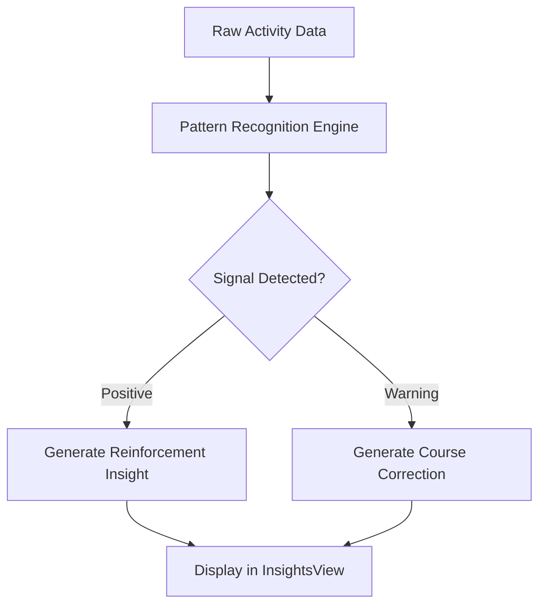

# Insights Feature — Product & Technical Specification

## 1. Description
The Insights feature provides users with AI-analyzed cognitive patterns based on their behavioral data. It focuses on identifying habit loops, stress signals, and productivity peaks.

## 2. Key UI Components
- **Insight Card**: Displays the title, description, and recommendation of a pattern.
- **Metric Grids**: Visual representation of productivity stats and mental energy levels.
- **Actionable Tooltips**: Explanations of how AI derived each insight.

## 3. Data Flow
1. **Source**: `insights.service.ts` -> `/insights_data`
2. **ViewModel**: `useInsightsViewModel.ts`
3. **View**: `InsightsView.tsx`

## 4. Key Metrics
- **Habit Strength**: Likelihood of a habit sticking over time.
- **Productivity Score**: Normalized efficiency across task completion.
- **Stress Level**: Correlation between work density and recovery.

### 4.1 Insight Generation Flow

