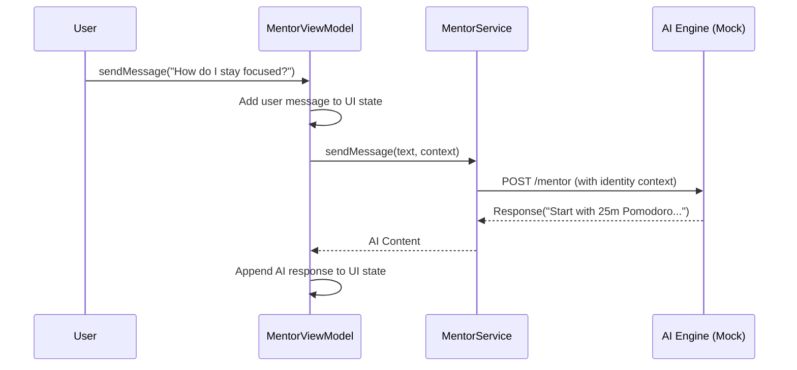

# AI Mentor Feature — Product & Technical Specification

## 1. Description
The AI Mentor is a contextual chat interface that provides growth guidance. It uses the user's identity, talents, and history to provide personalized advice.

## 2. Key UI Components
- **Chat Feed**: Optimized messaging interface with role-based styling.
- **History Sidebar**: List of past conversations for easy recall.
- **Contextual Suggestions**: AI-generated prompts based on current progress.

## 3. Data Flow
1. **Source**: `mentor.service.ts` -> `/mentor`
2. **ViewModel**: `useMentorViewModel.ts`
3. **View**: `MentorView.tsx`

### 3.1 Chat Interaction Sequence

## 4. Features
- **Context-Awareness**: The mentor "remembers" your identity traits and vision.
- **Real-Time Integration**: Seamless streaming of AI responses.
- **History Management**: Browse and resume any previous growth discussion.
