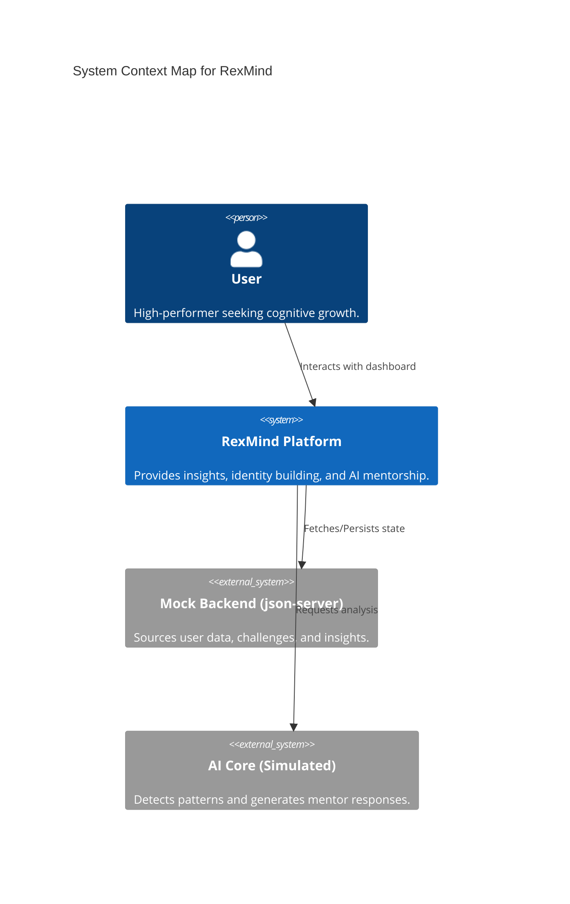
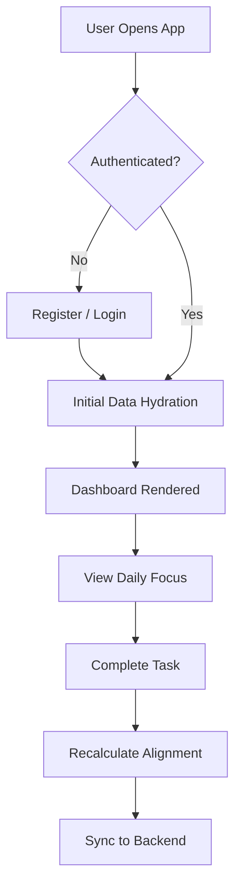
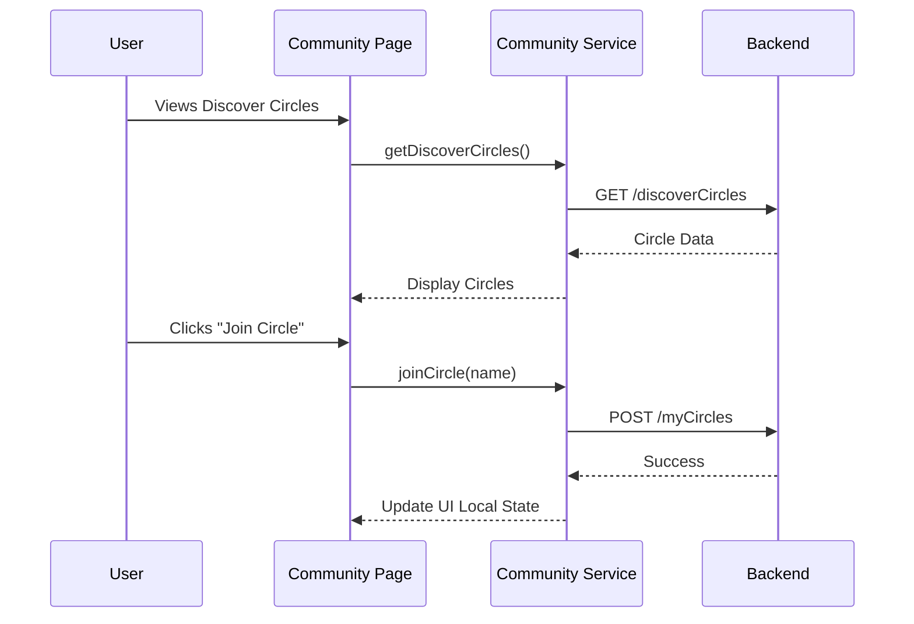

# RexMind — Product Requirements & Functional Specification

## 1. Overview
RexMind is an AI-powered "Human Potential Operating System" designed to help high-performers quantify their cognitive patterns, align their daily actions with a target identity, and leverage AI mentorship to overcome growth plateaus.

### 1.1 System Context Diagram

## 2. Assumptions
- **User Privacy**: All AI analysis is performed on user-consented data.
- **Scalability**: The system is designed for a global user base with low-latency requirements.
- **Integration**: Future versions will integrate with external health and productivity APIs (e.g., Apple Health, Google Calendar).

## 3. Actors / Roles
- **User**: The primary actor who interacts with the dashboard, joins circles, and consults the AI Mentor.
- **AI Mentor**: An active system actor providing real-time feedback and pattern detection.
- **System Admin**: (Planned) Manages community circles and platform-wide configurations.

## 4. Feature Breakdown
### 4.1. Authentication & Security
- User Registration & Login (Email/Password).
- Secure Session Management (HTTP-only Cookies).
- Protected Dashboard Routes (Middleware-level).

### 4.2. Core Dashboard
- **Identity Builder**: Vision, traits, and alignment tracking.
- **Pulse System (Insights)**: Habit loops, energy levels, and productivity stats.
- **Talent Discovery**: AI-identified strengths and development paths.
- **Growth Challenges**: Structured tasks and micro-commitments.
- **Community Circles**: Accountability groups and discussions.
- **AI Mentor**: Context-aware chat interface.

### 4.3. User & Settings
- Profile Management (Name, Timezone).
- Notification Preferences (Granular toggles).
- Privacy Controls (Data visibility and AI learning).

## 5. Use Cases
### UC-1: User Registration
- **Actor**: User
- **Trigger**: User navigates to /register.
- **Preconditions**: User is not logged in.
- **Success Flow**: User provides name, email, and password -> System validates -> Account created -> User redirected to /dashboard.
- **Fail Flow**: Email already exists or validation fails.

### UC-2: Identity Alignment Tracking
- **Actor**: User, System
- **Trigger**: User updates a goal or trait.
- **Success Flow**: User modifies goal progress -> System re-calculates Alignment Score -> Score is updated on Dashboard.

### UC-3: AI Mentorship Query
- **Actor**: User, AI Mentor
- **Trigger**: User sends a message in the Mentor chat.
- **Success Flow**: User asks a growth question -> AI processes user context (Identity, Challenges) -> AI provides personalized coaching.

## 6. Functional Requirements
### 6.1. Auth (FR-1.x)
- **FR-1.1**: System must prevent unauthenticated users from accessing any route under /dashboard.
- **FR-1.2**: Passwords must be validated for minimum 8 characters, including symbols and numbers (Zod-enforced).

### 6.2. Identity Builder (FR-2.x)
- **FR-2.1**: User must be able to edit their Vision Statement at any time.
- **FR-2.2**: Alignment Score must be calculated as the average of all active goal progress percentages.

### 6.3. Insights & Analytics (FR-3.x)
- **FR-3.1**: The system must detect and flag "Warning" patterns (e.g., afternoon energy dips).
- **FR-3.2**: Productivity stats must update in near real-time as user data changes.

## 7. Non-Functional Requirements
- **NFR-1.1 Security**: All API communication must be encrypted via HTTPS.
- **NFR-1.2 Performance**: Dashboard page load (FCP) must be under 800ms on 4G connections.
- **NFR-1.3 Availability**: System targets 99.9% uptime for core dashboard services.
- **NFR-1.4 Accessibility**: UI must achieve WCAG 2.1 Level AA compliance.

## 8. User Flows

### 8.1 Onboarding & Daily Check-in Flow

### 8.2 Community Engagement Flow

## 9. Business Rules
- **BR-1**: A user can belong to a maximum of 5 active Community Circles.
- **BR-2**: Alignment Score only updates when a goal's progress changes by at least 1%.
- **BR-3**: AI Mentor context is limited to the last 50 messages to ensure performance.

## 10. Data Requirements
### Entity: User
- `id` (UUID, Required)
- `email` (String, Required, Unique)
- `name` (String, Required)
- `identityAlignment` (Number, 0-100)

### Entity: Challenge
- `title` (String, Required)
- `status` (Enum: active, completed, skipped)
- `progress` (Number, 0-100)

## 11. Edge Cases & Error Handling
- **Empty State**: System must display "No insights detected yet" if the user has < 24h of data.
- **API Failure**: Graceful degradation to cached local state with a "Syncing Offline" indicator.
- **Session Expiry**: Redirect to /login with a toast notification when the mock token expires.

## 12. Acceptance Criteria
### Feature: Goal Progress Update
- **Given** I am on the Identity page
- **When** I slide a goal's progress to 80%
- **Then** the progress bar should update immediately
- **And** the global Alignment Score should reflect the change upon the next dashboard visit.

## 13. Risks & Open Questions
- **Data Accuracy**: How do we ensure the AI correctly identifies "stress signals" vs "unproductive periods"?
- **Offline Support**: Should users be able to use the AI Mentor while offline? (Currently: No).
