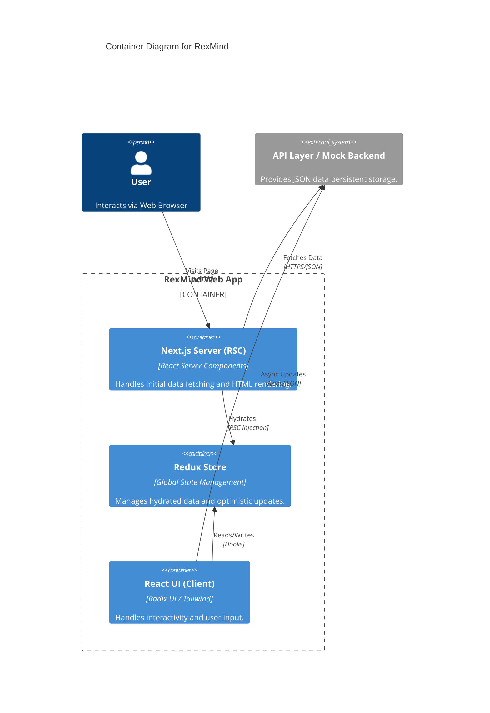

# System Design & Design System — RexMind

## 1. Design Philosophy
RexMind uses a **Premium Neo-Skeuomorphic** aesthetic, combining clean glassmorphism with high-contrast functional elements.

## 2. Component Hierarchy
- **Shared UI**: Atom-level components (Button, Input, Badge) from Radix UI.
- **Dashboard Components**: Molecule-level components (DashboardCard, ProgressBar, SkeletonCard).
- **Feature Views**: Organism-level layouts that assemble features into pages.

### 2.1 C4 Container Diagram

## 3. Theme Tokens
- **Colors**:
  - `primary`: Vibrant Indigo/Violet gradient for growth elements.
  - `secondary`: Subdued greys for backgrounds to reduce cognitive load.
  - `accent`: Gold/Amber for high-confidence talents.
- **Typography**: Inter (Variable) for high readability across densities.

## 4. Layout System
- **Sidebar Navigation**: Persistent desktop nav with mobile bottom-sheet fallback.
- **Page Headers**: Standardized `PageHeader` with support for global actions (Add, Save, Edit).
- **Responsive Grid**: Fluid 1 -> 2 -> 3 column transitions based on viewport width.

## 5. Performance Optimization
- **Image Optimization**: Using `next/image` for blurred placeholders and WebP delivery.
- **Code Splitting**: Feature pages are dynamically imported to minimize initial bundle size.
- **Streaming**: Using Next.js 14 streaming to deliver the header and sidebar instantly while the content hydrates.
